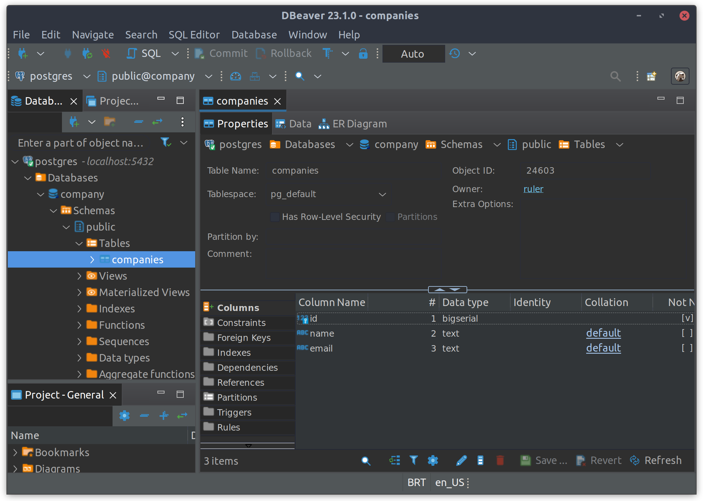

# SOME ANSIBLE BASED AUTOMATED DEPLOYMENT PLAYBOOKS TO CREATE USERS, DATABASES AND TABLES

## TABLE OF CONTENTS

[OVERVIEW](#overview)

[PREREQUISITES](#prerequisites)

[USE CASES](#use-cases)

[REFERENCES](#references)

## OVERVIEW

The objective of this README.md document file is to provide help on how to run the automated deployment, as a Proof of Concept (POC), of some Ansible automated playbooks files to create users, databases and tables.

A local Postgis dbms server based on Docker is available at the [Postgres](https://github.com/rubenschagas/postgres) project.

It is also recommended to use a Portainer management UI which allows you to easily build and manage containers your Docker host, available at [Portainer project](https://github.com/rubenschagas/portainer).



## PREREQUISITES

```
1. "docker": "24.0.2";
2. "docker compose": "2.18.1";
3. "a postgres dbms client, like DBeaver": ">=23.x";
4. "having a local PostgreSQL/Postgis dbms server, as shown on the OVERVIEW section".
```

## USE CASES

```
cd ansible-playbooks/
ansible-playbook -vv -e "ansible_user=ansible" -K create-ansible-user.yml
ansible-playbook -vv -e "ansible_user=ansible" -K create-postgres-user-db-table.yml
```

## REFERENCES

#### [Official Ansible Documentation](https://docs.ansible.com/ansible/2.9/index.html)